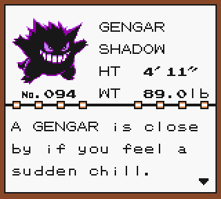
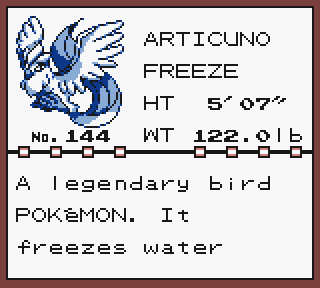

# Clases
## Clase Pokemon

La clase pokemon contiene atributos que definirían un pokémon común, tiene dos constructores uno que es para cuando se añada un pokemon avistado y otro para añadir un pokemon que ha sido capturado.

El método to String de esta clase está sobrescrito para que se asemeje a una entrada de la pokedex de los primeros juegos.

## Clase Pokemon Legendario

La clase pokemon legendario hereda los atributos de la clase pokemon con un atributo único que es la localización. A su vez también hereda los contructores de la clase Pokemon solo que inicializando el atributo localización.

Al igual que la clase Pokemon tiene sobrescrito el método to String, es prácticamente igual que el de la clase Pokemon pero mostrando por pantalla también el atributo localización.

## Lista Pokemon

La finalidad de esta clase es ahorrarnos el trabajar con arrays deade la clase principal, esta clase tiene como atributo un array de Pokemon que almacenara objetos de las clases descritas anteriormente.

En esta clase cuenta con metodos para añadir pokemon al atributo array, otro para eliminar pokemon de este array, uno para mostrar por pantalla la información de cada objeto dentro del array y un ultimo metodo que retorna un objeto pokemon al pasar como parámetro la posición de este dentro del array.

## App

Esta es la clase ejecutable del proyecto lo principal que tiene esta clase es un switch que hace de menú de interacción con el usuario.

### Readme
Para volver al README pinche [aquí](/README.md)