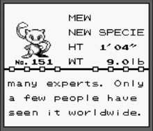

# Guía para Entrenadores

## ¡¡Saludos entrenador!!

Si has llegado hasta aquí es porque necesitas algo de ayuda para usar tu nueva pokédex, como profesor pokémon que soy te aseguro que para el final de esta guía sabrás usar esta pokédex a la perfección.

Al entrar has debido de ver el siguiente menú, muy bien dejame explicarte la función de cada opción:

**Opcion a:** Esta función te permitirá añadir un pokemon común a tu lista de avistamientos, para registrar el pokemon deberás introducir su nombre y tipo.

**Opción b:** Está función al igual que la anterior añadirá un pokemon a tu lista de avistamientos con la peculiaridad de que al tratarse de un pokemon legendario lo cual significa que solo hay uno como él dentro del juegoasí que para asegurarte donde lo encontraste deberás introducir a parte de su tipo y nombre, la localización donde lo viste.

**Opción c:** Esta opción es para que una vez hayas capturado un pokémon que habías avistado anteriormente ahora o pases a tu lista de capturados, al hacer esto deberás de añadir la información restante que será el peso, la altura y una pequeña descripción del pokemon.

**Opción d:** Gracias a esta opción podrás ver un listado de todos los pokemon que hayas avistado a lo largo de tu aventura. Recuerda que en esta lista no aparecera toda la información sobre un pokemon.

**Opción e:** Al igual que la opción anterior esta te mostrará una lista de pokemon, pero esta lista es de los pokémon que ya has atrapado. Esta lista tendra toda la información del pokemon que has atrapado.

**Opción f:** La más fácil de entender de las opciones, esta cerrará la pokedex.

## Adiós entrenador
Con esto concluye esta guía para aprender a usar la pokedex espero que ya te haya quedado claro su funcionamiento. 

Ánimo con tu viaje entrenador, veamos si consigues atraparlos a todos.

Si quieres volver al readme pulsa [aquí](../README.md)